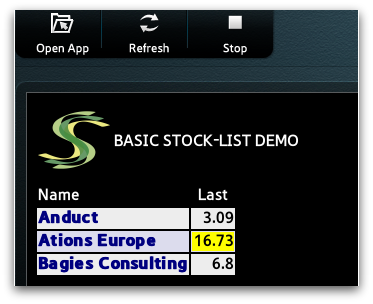

# Lightstreamer - Basic Stock-List Demo - Samsung Smart TV Client

<!-- START DESCRIPTION lightstreamer-example-stocklist-client-smarttv -->

This demo shows how to use the <b>Lightstreamer JavaScript Client library</b> and the <b>Samsung Smart TV SDK</b> to create a simple streaming-enabled application.

 

## Details

This demo displays real-time last price data for 3 stocks, simulated Stock-List data is received from the Lightstreamer Server deployed @ [http://push.lightstreamer.com](http://push.lightstreamer.com). 

The demo includes the following client-side functionalities:
* A [Subscription](http://www.lightstreamer.com/docs/client_javascript_uni_api/Subscription.html) containing 3 items, subscribed to in <b>MERGE</b> mode, feeding a [StaticGrid](http://www.lightstreamer.com/docs/client_javascript_uni_api/StaticGrid.html).

<!-- END DESCRIPTION lightstreamer-example-stocklist-client-smarttv -->

## Build

To build and run your own version of this demo, follow these steps:

* Download and install the [Samsung SMART TV SDK](https://www.samsungdforum.com/Devtools/SdkDownload) (choose the platform of your interest), this example is based on version 4.5 of the SDK.
* Download and install the [Oracle VM Virtual Box](http://www.virtualbox.org/).
* Download and install the [Smart TV SDK Emulator Image for Virtual Box](https://www.samsungdforum.com/Devtools/SdkDownload) and import it in Virtual Box.
* Download the [latest Lightstreamer distribution](http://www.lightstreamer.com/download) and copy the `lightstreamer.js` file from the Lightstreamer JavaScript Client SDK (located under the `DOCS-SDKs/sdk_client_javascript/lib` folder) into the `app/javascript` folder of this project.
* Download the [require.js](http://requirejs.org/) file and copy it into the `app/javascript` folder of this project.

Once ready, create in eclipse a new <b>Samsung Smart TV JavaScript App Project</b> and overwrite the resources of this project on those newly created.

### Deploy

To run the demo, please right-click on the eclipse project and press <b>Run As -> Run Current Project</b> in Samsung Smart TV Emulator. The Emulator will be launched automatically and the demo will be deployed and started as soon as the emulator goes up. 

You may run the demo against your local server instead of using our online server @ [http://push.lightstreamer.com:80](http://push.lightstreamer.com:80). The server to which the demo will connect to is
configured in the `app/javascript/Main.js` file. In this case, the example requires that the [QUOTE_ADAPTER](https://github.com/Weswit/Lightstreamer-example-Stocklist-adapter-java) and [LiteralBasedProvider](https://github.com/Weswit/Lightstreamer-example-ReusableMetadata-adapter-java) have to be deployed in your local Lightstreamer server instance. The factory configuration of Lightstreamer server already provides this adapter deployed.

## See Also

### Lightstreamer Adapters Needed by This Demo Client

<!-- START RELATED_ENTRIES -->
* [Lightstreamer - Stock-List Demo - Java Adapter](https://github.com/Weswit/Lightstreamer-example-Stocklist-adapter-java)
* [Lightstreamer - Reusable Metadata Adapters- Java Adapter](https://github.com/Weswit/Lightstreamer-example-ReusableMetadata-adapter-java)

<!-- END RELATED_ENTRIES -->

## Related Projects

* [Lightstreamer - Stock-List Demos - HTML Clients](https://github.com/Weswit/Lightstreamer-example-Stocklist-client-javascript)
* [Lightstreamer - Basic Stock-List Demo - iOS Client](https://github.com/Weswit/Lightstreamer-example-StockList-client-ios)
* [Lightstreamer - Basic Stock-List Demo - jQuery (jqGrid) Client](https://github.com/Weswit/Lightstreamer-example-StockList-client-jquery)
* [Lightstreamer - Stock-List Demo - Dojo Toolkit Client](https://github.com/Weswit/Lightstreamer-example-StockList-client-dojo)
* [Lightstreamer - Basic Stock-List Demo - Java SE (Swing) Client](https://github.com/Weswit/Lightstreamer-example-StockList-client-java)
* [Lightstreamer - Basic Stock-List Demo - .NET Client](https://github.com/Weswit/Lightstreamer-example-StockList-client-dotnet)
* [Lightstreamer - Stock-List Demos - Flex Clients](https://github.com/Weswit/Lightstreamer-example-StockList-client-flex)
* [Lightstreamer - Basic Stock-List Demo - Silverlight Client](https://github.com/Weswit/Lightstreamer-example-StockList-client-silverlight)
* [Lightstreamer - Basic Stock-List Demo - Android Client](https://github.com/Weswit/Lightstreamer-example-StockList-client-android)
* [Lightstreamer - Basic Stock-List Demo - Windows Phone Client](https://github.com/Weswit/Lightstreamer-example-StockList-client-winphone)
* [Lightstreamer - Basic Stock-List and Round-Trip Demo - BlackBerry Client](https://github.com/Weswit/Lightstreamer-example-StockList-client-blackberry)

## Lightstreamer Compatibility Notes

* Compatible with Lightstreamer JavaScript Client library version 6.0 or newer.
